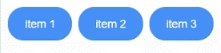

# Styled-Button-Group


Source code at https://github.com/abdullah-jaffer/styled-button-group

## Installation

    npm install --save styled-button-group

or

    yarn add styled-button-group

## Preview


## Usage

``` 
import SelectionList from 'styled-button-group';

function App() {
  const getUpdatedList = (name, selected, index, updatedList) => {
  console.log(`${name} ${selected} ${index}`);
  console.log(updatedList);
};

  return (
    <SelectionList
      data={[
        { name: 'item 1', selected: true },
        { name: 'item 2', selected: true },
        { name: 'item 3', selected: true },
      ]}
      onButtonClick={getUpdatedList}
    />
  );
}

export default App;
```               

## Customizations

``` 

    <SelectionList
      noEdit={true} //To make buttons non-clickable 
      colors={{ 
        activeColor: 'blue', 
        activeText: 'blue', 
        disabledColor: 'blue', 
        disabledText: 'blue' 
      }}
      styles={{ 
        padding: '2px 2px 2px 2px', 
        margin:'2px 2px 2px 2px', 
        fontSize:'14px', 
        lineHeight:'24px'
       }}
      data={[
        { name: 'item 1', selected: true },
        { name: 'item 2', selected: true },
        { name: 'item 3', selected: true },
      ]}
    />
    
ENJOY!!
```      